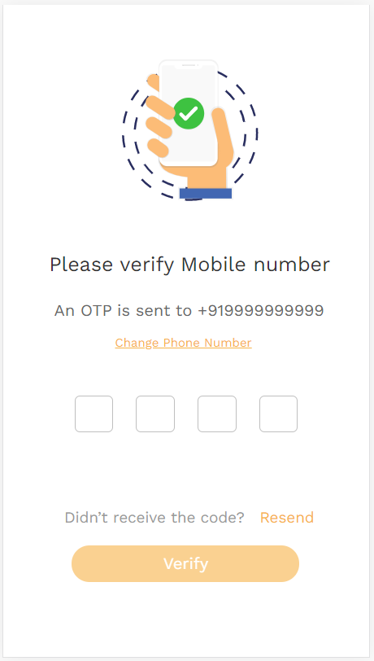

# OTP-Verification-AdmitKard
A sample otp verification while signing in with mobile number

### Setting Up On System
1. Clone the repository to the system
2. `npm start` - To start the server
3. Open a new terminal
4. `cd client` - Go to client directory
5. `npm start` - To run the application

#### Technologies used
`React` `Redux` `NodeJS` `ExpressJS` `MongoDB`

#### Video of app working
https://drive.google.com/file/d/1XNPSZxBZ7lGMgYb-dHtxLUIgRiyKMh7p/view?usp=sharing

#### Images of pages
##### SignIn-Page

##### Otp-Verification

##### Success-Page

